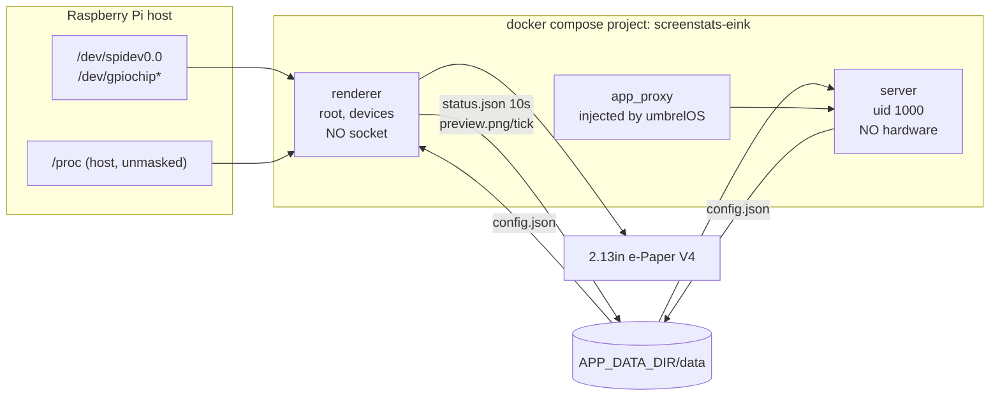

# ScreenStats — Umbrel app plan

An Umbrel community-app-store app that drives a **Waveshare 2.13" e-Paper HAT V4**
(250×122, 1-bit) showing: clock, host CPU / RAM / disk usage, a time-of-day
greeting, and current weather for the location resolved from the public IP.

- Store id: `screenstats` · App id: `screenstats-eink` · Panel: `epd2in13_V4`
- **Confirmed target: umbrelOS on a Raspberry Pi 4 Model B** — the HAT sits on the
  same device that runs Umbrel, so `renderer` drives the panel locally. No remote
  agent needed.

Pi 4B being confirmed pins down two things that were previously variable:

- **Board type is `0x11`** (`revision-codes.adoc:327`; Pi 5 is `0x17`). gpiozero's
  `LGPIOFactory` computes
  `chip = 4 if (revision & 0xff0) >> 4 == 0x17 and exists('/dev/gpiochip4') else 0`
  (`gpiozero/pins/lgpio.py:63-68`), so on a Pi 4B it deterministically opens
  **`/dev/gpiochip0`**. The Pi 5 `gpiochip4` ambiguity and the kernel-version split
  are both out of scope — one less failure mode.
- **Image is `umbrelos-pi4`**, boot type `rpi-tryboot`, kernel
  `linux-image-rpi-v8`. Pi 4 is **microSD-boot only** (umbrelOS wiki: "Booting from
  NVMe or USB is not supported on Raspberry Pi 4"), which makes the SPI fix in §6
  easy — the boot partition is on a card you can pull.

Every non-obvious claim below is cited to a primary source. Items marked
`UNVERIFIED` must be confirmed on the device before being relied on.

---

## 0. Read this first — two hard constraints that shape the whole design

### 0.1 You cannot show a live, ticking clock. Waveshare forbids it.

> "it is recommended that the refresh interval is **at least 180s**, and refresh at
> least once every 24 hours"
> — [2.13inch e-Paper HAT Manual, Precautions #3](https://www.waveshare.com/wiki/2.13inch_e-Paper_HAT_Manual)

> "the screen cannot be powered on for a long time. When the screen is not
> refreshed, please set the screen to sleep mode or power off it. Otherwise, the
> screen will remain in a high voltage state for a long time, which will **damage
> the e-Paper and cannot be repaired!**"
> — ibid., Precautions #2

> "you cannot refresh them with the partial refresh mode all the time. After
> refreshing partially several times, you need to fully refresh EPD once.
> Otherwise, the display effect will be abnormal, **which cannot be repaired!**"
> — ibid., Precautions #1

> "During the fast refresh or partial refresh of the electronic paper, it is
> recommended to add a **full-screen refresh after 5 consecutive operations**"
> — [2.13inch e-Paper V4 Specification, p.9](https://files.waveshare.com/upload/4/4e/2.13inch_e-Paper_V4_Specification.pdf)

So the clock shows **HH:MM at 5-minute granularity**, and the panel sleeps between
ticks. This is a hardware limit, not a shortcut. Anything faster degrades and
eventually destroys the panel. Panel life is rated `1000000 times or 5 years`
(V4 Spec §8) — at a 300 s tick that is ~105 k refreshes/year, comfortably inside
budget.

### 0.2 umbrelOS does not enable SPI. The app cannot work until that is fixed.

umbrelOS's Raspberry Pi boot config enables I²C and **not** SPI. Complete file
(`packages/os/build-steps/setup-raspberrypi/config.txt` @ `119c7db`):

```
dtoverlay=vc4-kms-v3d
max_framebuffers=2
arm_64bit=1
dtparam=nvme
# Enable the standard GPIO header I2C bus.
dtparam=i2c_arm=on
```

There is no `dtparam=spi=on` anywhere in `packages/os`, and the only force-loaded
module is `i2c-dev`. ⇒ **`/dev/spidev0.0` does not exist on a stock umbrelOS Pi
image**, so no container can drive this HAT out of the box.

Worse, `config.txt` is installed at image-build time and then the whole of
`/boot/firmware/*` is copied into the rugix boot layer
(`packages/os/rugix/recipes/umbrelos-boot/steps/00-install.sh`), which is baked
into two A/B boot partitions (`rugix-bakery.toml`). **[INFERENCE]** a hand edit is
therefore likely reverted by the next umbrelOS OTA update.

Handled by §6. This is the single biggest project risk and it is a *host*
prerequisite, not something app code can fully solve.

---

## 1. Scope and interpretation

| Ask | Delivery |
|---|---|
| the time | `HH:MM` + weekday/date, 5-min granularity (§0.1) |
| current CPU, RAM, disk usage | **host** figures, segmented gauge + percentage |
| Good Morning / Afternoon / Evening | local-wall-clock greeting, sunrise/sunset aware |
| weather below | current temp, "feels like", condition, today's lo/hi |
| "based on ip-api api to fetch the location" | ip-api.com supplies **lat/lon/city/timezone only** |

**Interpretation to confirm:** ip-api.com is a geolocation service — it returns no
weather. So ip-api resolves *where you are*, and a second keyless API supplies the
forecast for those coordinates. Chosen provider: **Open-Meteo** (§4.2).

---

## 2. Verified layout — already built and proven

`tools/layout_preview.py` renders the exact 250×122 1-bit frame with no hardware
attached, and **mechanically asserts** that (a) the buffer is 4000 B after the
driver's rotation and (b) no ink falls off-panel.

```
$ python3 tools/layout_preview.py /tmp/p.png --case nominal
nominal: /tmp/p.png ok  frame=4000 B  no clipping
```

```
 x0                          147 152                    246  249
 ┌────────────────────────────┬──┬───────────────────────────┐ y0
 │  14:35                     │  │ CPU ▓▓▁▁▁▁  42%           │
 │  (mono bold 44)            │  │ RAM ▓▓▓▓▓▁  71%           │
 │ Sat 16 Aug                 │  │ DSK ▓▓▁▁▁▁  31%           │
 ├────────────────────────────┴──┴───────────────────────────┤ y66
 │ Good Afternoon           feels 10°              11°       │
 ├───────────────────────────────────────────────────────────┤ y90
 │ Melbourne · Part cloudy                      5°/11°       │
 └───────────────────────────────────────────────────────────┘ y121
```

Two real defects were found and fixed by building this harness rather than
guessing:

1. **The 4000-byte frame only exists after rotation.** The landscape (250,122)
   image packs to 32 B × 122 = **3904 B**; `getbuffer()` rotates to native
   (122,250) where the stride is 16 B → 4000 B. Asserting on the landscape image
   fails.
2. **`100%` clipped off the right edge.** A fixed x for the percentage column
   works for `42%` and silently truncates `100%`. Percentages are now
   right-aligned against a hard `x=246` margin, with the gauge width derived from
   the measured text width.

Verified cases: `nominal`, `evening`, and `overflow` (longest city, longest WMO
label `T-storm hail`, three 100% gauges, negative temperatures, stale marker).
The detector was itself negative-controlled — disabling the ellipsiser makes it
report `ink outside panel: bbox x 250..273`.

**Rule for implementation:** `renderer/screenstats/layout.py` is this file's
`_draw_frame()`; `tools/layout_preview.py` stays the iteration loop. Never
iterate layout on the panel — a 180 s floor makes it unusable and harmful.

---

## 3. Architecture

Two services, **one image**, split strictly on privilege.



### Why split

`renderer` needs root + host devices. `server` is reachable from a browser
through `app_proxy`. Putting a listening socket inside the privileged container
is the one thing worth avoiding here, so:

- **`renderer`** — root, `/dev` access. Owns the panel and **all** data
  collection. Opens no socket.
- **`server`** — `user: "1000:1000"`, no devices. Owns the web UI, the config
  API, and the widget endpoint. Touches no hardware.

### Why one image

`renderer` and `server` are both Python and share `config.py`, `state.py`, and
the WMO table. One image with two `command:`s halves pull size and makes version
skew between the two impossible.

### State contract — `${APP_DATA_DIR}/data`

Single writer per file, publish by `os.replace()` (atomic rename on the same
filesystem). No locks, no IPC, no partial reads.

| Path | Writer | Reader | Cadence |
|---|---|---|---|
| `config.json` | `server` | `renderer` | on user save |
| `cache/geo.json` | `renderer` | — | ≤1×/24 h |
| `cache/weather.json` | `renderer` | — | ~15 min |
| `state/status.json` | `renderer` | `server` | 10 s |
| `state/preview.png` | `renderer` | `server` | per panel tick |

`renderer` runs two independent loops:

- **collect loop, 10 s** — host metrics + cached weather → `status.json`. No
  panel I/O. This is what keeps the umbrelOS widget live while the panel is
  correctly idle.
- **paint loop, `refresh_seconds` (≥180)** — build frame, push to panel, sleep
  panel, write `preview.png`.

Because both the panel and the widget read from one collector, they can never
disagree.

### Panel refresh policy (`display/epd.py`)

Per §0.1, a strict cycle. `tick % 6 == 0` → full refresh, otherwise partial:

```python
# full:      init() -> Clear(0xFF) -> displayPartBaseImage(buf) -> sleep()
# partial:   init() -> displayPartial(buf) -> sleep()          # max 5 in a row
```

Non-obvious requirements, all from source:

- `epd.sleep()` is mandatory after **every** tick (§0.1) and already calls
  `epdconfig.module_exit()`, closing SPI.
- After sleep, "the sent image data will be ignored, and it can be refreshed
  normally only after initializing again" → every tick re-`init()`s.
- Switching partial → full needs a fresh `init()`: *"The full refresh
  initialization function needs to be added when the e-Paper screen is switched
  from partial refresh to full refresh."* (wiki FAQ)
- `displayPartial()` re-issues `0x3C/0x01/0x11/SetWindow/SetCursor` itself and
  pulses RST, so there is **no** `init(PART_UPDATE)` as there was on V2.
- Always send the full 4000 B frame; "partial" is a waveform mode, not a
  sub-rectangle transfer.
- `getbuffer()` on a wrong-sized image logs a warning and returns a
  **3750-byte** buffer (`int(122/8)*250`) instead of 4000 — a silent upstream
  bug. Assert `len(buf) == 4000` before every push.

`quiet_hours` (optional): skip painting overnight, but still force one full
refresh on entry and never exceed 24 h without a refresh — the V4 spec warns
that going 24 h unrefreshed causes *"Ghosting" or "Image Sticking"* (§16.5).

### Display abstraction

`display/base.py` defines a 3-method protocol (`push(image, full)`, `sleep()`,
`close()`), selected by `SCREENSTATS_DRIVER`:

| driver | use |
|---|---|
| `epd` | real panel (default on arm64 with `/dev/spidev0.0`) |
| `png` | writes `preview.png` only — full app on x86, no hardware |
| `null` | discards frames; for tests |

This is what makes the app developable and CI-testable on an x86 machine, and it
is the same seam that would later allow a remote render agent if the user's
Umbrel is x86 and the Pi is a separate box.

---

## 4. External data

### 4.1 Geolocation — ip-api.com

- `GET http://ip-api.com/json/?fields=33604048` → `status,message,city,lat,lon,timezone,offset`
- **Free tier is plaintext HTTP only.** HTTPS returns
  `403 {"status":"fail","message":"SSL unavailable for this endpoint…"}`
  ([docs](https://ip-api.com/docs/api:json), verified live). The container must be
  allowed outbound `http://`.
- 45 req/min per IP. Throttling returns **HTTP 429 with an empty body**
  (`Content-Length: 0`) — branch on the status code *before* parsing JSON.
  `X-Ttl` is the only backoff signal; there is no `Retry-After`.
- Lookup failures return **HTTP 200** with `{"status":"fail"}`. An `if res.ok`
  check is not sufficient.
- Called **once per container start, then ≤1×/24 h**, persisted to
  `cache/geo.json`. A home IP's coarse location does not move. Never on the paint
  loop.
- Fallback if plaintext egress is blocked: `https://ipwho.is/` (keyless, HTTPS,
  1000/day, `timezone.id` holds the IANA name).

### 4.2 Weather — Open-Meteo (keyless, HTTPS)

```
https://api.open-meteo.com/v1/forecast
  ?latitude=<lat>&longitude=<lon>
  &current=temperature_2m,relative_humidity_2m,apparent_temperature,is_day,weather_code,wind_speed_10m
  &daily=weather_code,temperature_2m_max,temperature_2m_min,sunrise,sunset
  &timezone=auto&forecast_days=1
```

Chosen because it is the only keyless option returning current conditions +
today's min/max + a machine-readable condition code + the IANA timezone in **one
HTTPS request**, and its terms explicitly permit *"personal home automation"*.
Fallback: MET Norway Locationforecast 2.0 `/compact` (needs a unique
`User-Agent`, has no daily aggregates, returns UTC only).

Query weight ≈ 1.1 against a 10 000/day free budget; a 15-min poll uses ~1 %.

Gotchas, all verified live:

- `timezone=auto` is **required in practice**. The docs say `timezone` is
  required with daily variables, but the API silently returns
  `"timezone":"GMT"` with HTTP 200 — giving wrong day boundaries, hence wrong
  lo/hi, with no error.
- Timestamps are timezone-**naive** local strings (`"2026-08-16T17:30"`).
  Parsing them as UTC is a full-offset error.
- `current.time` is the model's 900 s step and lags wall clock by up to 15 min.
  **Never drive the clock from it** — render the clock from system time.
- Echoed `latitude`/`longitude` are the grid-cell centre, not your input
  (−37.9653 → −37.926186). Use ip-api's `city` for the label.
- `wind_speed_unit=mph` reports the unit string as `"mp/h"`.
- No `Cache-Control` and no rate-limit headers; the client owns the TTL. The
  server-side limiter **counts failed requests**, so retry storms deepen a block.

**Failure policy:** persist the last good payload with a timestamp and re-render
from cache on error (`stale` marker appears once the cache exceeds 2× the poll
interval — already in the layout). Never blank the weather block on a transient
429. Geolocation and weather failures are independent. Explicit 5 s connect /
10 s read timeouts so a hung socket cannot stall the paint loop.

### 4.3 WMO condition codes

Open-Meteo emits exactly 28 codes: `0-3, 45, 48, 51-57(odd), 61-67(odd),
71-77(odd), 80-82, 85, 86, 95, 96, 99`. Everything else must fall through to a
`—` default. Short labels are pre-fitted to the panel (`Part cloudy`,
`Rime fog`, `T-storm hail`, …). Source: Open-Meteo's own
`getWeatherCode()` in `open-meteo-website/src/lib/utils/meteo.ts` — the upstream
WMO table 4677 does **not** match, because Open-Meteo collapses it.

### 4.4 Clock, timezone and greeting

Authority order: user override in app config → `open_meteo.timezone` →
`ip_api.timezone` → UTC. **Always the IANA identifier, never a numeric offset** —
`ip-api.offset` and `utc_offset_seconds` are point-in-time values that go stale at
the next DST transition. Install `tzdata`, set `TZ`, then the clock is just
`datetime.now()` and the OS handles DST.

Greeting: `< 12:00` Morning, `12:00–17:59` Afternoon, `≥ 18:00` Evening, on local
wall clock, cross-checked against `daily.sunrise[0]`/`sunset[0]` so an 18:30
midsummer greeting can stay "Good Afternoon" while it is still light.

### 4.5 Host metrics

Collected by `renderer` only.

- **CPU** — delta over `/proc/stat`. Docker does not mask `/proc`, so this is the
  host figure. Requires two samples; the collect loop's 10 s interval supplies them.
- **RAM** — `/proc/meminfo`, `MemTotal - MemAvailable`. Host figure.
- **Disk** — `os.statvfs('/data')`. **No host mount needed.** Verified on-device:
  everything lives on `mmcblk0`, and app data is partition `p6` (`data`, ext4,
  `/run/rugix/mounts/data`). Since `${APP_DATA_DIR}/data` is already bind-mounted
  into the container at `/data`, `statvfs` on it reports that exact filesystem —
  the same volume umbrelOS's own Storage widget reports. The earlier `/:/host:ro`
  mount is therefore dropped: it would have reported the *root* filesystem, which
  is `system-a` (a fixed 5 GiB slot) and not the number anyone cares about.
  Uses `f_bavail` (not `f_bfree`) so the figure matches what a non-root process
  can actually consume — the `data` partition reserves 0.5 % for root
  (`bootstrapping-pi.toml`: `-m 0.5`).

---

## 5. Repository layout

```
screenstats/                          # community app store repo root
├── umbrel-app-store.yml              # id: screenstats · name: ScreenStats
├── README.md                         # install + SPI prerequisite
├── PLAN.md                           # this file
├── screenstats-eink/                 # dir name MUST equal app id
│   ├── umbrel-app.yml
│   ├── docker-compose.yml
│   ├── hooks/pre-start               # host-side SPI probe (executable)
│   └── data/{cache,state}/.gitkeep
├── image/                            # one image, two entrypoints
│   ├── Dockerfile
│   ├── requirements.txt
│   ├── screenstats/
│   │   ├── config.py                 # schema + defaults + atomic load/save
│   │   ├── state.py                  # os.replace publish helpers
│   │   ├── metrics.py                # /proc/stat, /proc/meminfo, statvfs
│   │   ├── geo.py                    # ip-api + ipwho.is fallback
│   │   ├── weather.py                # Open-Meteo + WMO table
│   │   ├── layout.py                 # _draw_frame() from tools/layout_preview.py
│   │   ├── renderer.py               # collect loop + paint loop
│   │   ├── server.py                 # stdlib ThreadingHTTPServer
│   │   └── display/{base,epd,png,null}.py
│   └── vendor/waveshare_epd/         # PINNED copy, see §7
└── tools/layout_preview.py           # built and verified
```

**Critical packaging rule:** on app *update* umbrelOS copies only
`docker-compose.yml`, top-level `*.template`, `exports.sh`, `torrc` and `hooks`
into app-data (`app-script` `UPDATE_FILES_WHITELIST`). Anything else in the
package exists on fresh installs but is **never updated**. ⇒ all Python code
ships **inside the image**, never as a bind-mounted file from the package.

---

## 6. The SPI prerequisite (§0.2), handled honestly

**Verified on the device (2026-08-16).** `/boot/firmware` is **not mounted**.
`lsblk` on `mmcblk0`:

| part | fs | mountpoint | rugix role |
|---|---|---|---|
| `p1` | vfat | **`/run/rugix/mounts/config`** | `EFI` / config — writable, persists across updates |
| `p2` | vfat | *(none)* | **`boot-a` — active slot, holds `config.txt`** |
| `p3` | — | *(none)* | `boot-b` standby, no filesystem yet |
| `p4` | ext4 | `/run/rugix/mounts/system` | `system-a` |
| `p5` | — | *(none)* | `system-b` standby |
| `p6` | ext4 | `/run/rugix/mounts/data` | `data`, label `data` |

And rugix v0.8.0 ships `boot/tryboot/autoboot.txt`:

```
[all]
tryboot_a_b=1
boot_partition=2
[tryboot]
boot_partition=3
```

So the firmware reads `autoboot.txt` from **p1**, then loads `config.txt` from the
*selected boot slot* — **p2** in normal operation. p1 is mounted and writable but
holds only `autoboot.txt`; the file that needs editing is on an **unmounted vfat
partition**. There is no persistent, supported place to put `dtparam=spi=on`.

Also verified: `/dev/gpiochip0` and `/dev/gpiochip1` exist as
`crw------- 1 root root 254, 0` — mode **0600 root:root**. umbrelOS ships **none**
of the Raspberry Pi OS udev rules, so there is no `gpio` or `spi` group at all.
That settles two things: `group_add` is impossible, and `renderer` **must** run as
root. It also confirms the dynamic char major (254) that makes the
`device_cgroup_rules: ["c *:* rwm"]` wildcard necessary (§7).

### Three layers

1. **Documented manual step (primary).** Power off, move the microSD to another
   machine, open `config.txt` on the **128 MiB** unlabelled FAT partition (the one
   holding `config.txt` + `overlays/`, NOT the 256 MiB one holding `autoboot.txt`),
   append `dtparam=spi=on`, reboot. Or run `tools/enable-spi.sh` over SSH.
2. **`hooks/pre-start` — read-only by default, opt-in repair.** Hooks run on the
   host as root before `docker compose up`. By default the hook only *probes*:
   it resolves the active slot from `boot_partition=` in p1's `autoboot.txt`,
   optionally mounts it **read-only** to check whether the line is already
   present, and records everything to `data/state/host-spi.json`.
   It writes to the boot partition **only** if the operator opts in by creating
   `data/enable-spi-autofix`. Deliberate: mounting and rewriting a live A/B boot
   slot from an app hook risks an unbootable device, and umbreld swallows hook
   failures (`"${hook}" || true`), so a partial write would be *invisible*. An app
   must not silently rewrite its host's bootloader config.
   With the opt-in set, the hook re-applies on **every** app start, which is what
   heals the OTA revert described below.
3. **Status page (source of truth).** `server` renders `host-spi.json` plus a live
   device probe, with the exact remedy. Precedent: `openthread-border-router`
   ships a browser wizard for this same class of host-hardware problem.

### Why the edit probably reverts — Pi 4B partition layout

From `packages/os/rugix/recipes/setup-rugix/files/bootstrapping-pi.toml`, the
`umbrelos-pi4` disk is:

| partition | size | fs | role |
|---|---|---|---|
| `EFI` | 256M | fat32 | ESP GUID `C12A7328-…` |
| **`boot-a`** | **128 MiB** | **fat32** | active boot slot — holds `config.txt` |
| **`boot-b`** | **128 MiB** | **fat32** | standby boot slot |
| `system-a` / `system-b` | 5 GiB each | ext4 | A/B root |
| `data` | rest | ext4 | `-m 0.5`, persisted (`state-data.toml`: `/data`) |

Two consequences:

1. **The fix is easy to apply offline.** Pi 4 boots from microSD only, and
   `boot-a` is **FAT32** — pull the card, mount it on any machine (it appears as
   size and contents; **the partitions carry no label**), append `dtparam=spi=on`.
2. **An OTA update writes a whole new boot slot.** rugix installs into the
   *standby* slot and switches; only `/data` is declared persistent. So a
   `config.txt` edit lives in one slot and is **not** carried into the next
   update's slot. This is why the `pre-start` self-heal in layer 2 is worth
   having rather than a one-time instruction.

### The two traps that make this fail silently

Both confirmed by SSH on the target Pi after a first attempt at the fix did not
take effect (`spi@7e204000/status` still `disabled`).

**Trap 1 — `/boot/firmware/config.txt` is a decoy.** It exists on the running root
filesystem, is world-readable, and its contents are *exactly* the umbrelOS boot
config you expect (`dtoverlay=vc4-kms-v3d`, `dtparam=i2c_arm=on`, …). It is the
build-time staging copy left behind by `setup-raspberrypi.sh`, which
`umbrelos-boot/00-install.sh` copies into the boot layer at image build. `findmnt`
confirms it is **not a mountpoint** — a plain directory on the rootfs. The Pi
firmware never reads it. Editing it over SSH does nothing at all.

**Trap 2 — the boot partitions carry no filesystem label.** Verified:

```
NAME          SIZE FSTYPE LABEL PARTLABEL MOUNTPOINT
├─mmcblk0p1   256M vfat                   /run/rugix/mounts/config
├─mmcblk0p2   128M vfat
└─mmcblk0p6 228.2G ext4   data            /run/rugix/mounts/data
```

Only `p6` has a label. Guidance that says "edit the volume named `BOOT-A`" — which
an earlier revision of this plan and its README repeated from a community forum
post — is **wrong for this image**. Inserting the card presents two *unlabelled*
FAT volumes, and the tempting one is the wrong one:

| partition | size | holds | correct? |
|---|---|---|---|
| `p1` | 256 MiB | `autoboot.txt`, `pieeprom.upd`, `vl805.bin` | ✗ contains **no** `config.txt` |
| `p2` | 128 MiB | `config.txt`, `cmdline.txt`, `*.dtb`, `overlays/` | ✓ |

So the partition must be identified **by size and contents**, never by name. The
README, the status page, and `tools/enable-spi.sh` were all corrected to do this;
the script resolves the slot from `boot_partition=` in p1's `autoboot.txt`
(verified `=2` on this device) rather than guessing at all.

### Confirmed on-device state

```
/dev/spidev*      -> No such file or directory      # SPI not enabled, as predicted
/dev/gpiochip0    -> crw------- 1 root root 254, 0  # 40-pin controller (chip 0 per Pi 4B 0x11)
/dev/gpiochip1    -> crw------- 1 root root 254, 1
grep -c Raspberry /proc/cpuinfo -> 1                # epdconfig stays on the RaspberryPi branch
```

`UNVERIFIED`, and the one remaining hardware unknown: **that `gpiochip0` is the
40-pin `pinctrl-bcm2711` controller** and not a firmware/virtual chip. gpiozero
defaults to chip 0 on a Pi 4B, so if the ordering were ever different the driver
would drive the wrong lines. Rather than ask again, `renderer` performs a startup
preflight that reads the chip labels from `/sys/bus/gpio/devices/*/label` and
fails loudly, naming the fix, if chip 0 is not the header controller. Cheap
manual confirmation if wanted: `cat /sys/bus/gpio/devices/gpiochip0/label`.

---

## 7. Waveshare driver: vendor it, do not pip-install it

Copy three files into `image/vendor/waveshare_epd/` and pin the upstream commit
in a comment (MIT header retained):

| file | size | upstream |
|---|---|---|
| `__init__.py` | 0 B | — |
| `epdconfig.py` | 9 973 B | `bc23f8e` |
| `epd2in13_V4.py` | 10 622 B | `3848951`, unchanged since 2023-08-14 |

Every alternative is broken:

- `waveshare-epd` on PyPI — **does not exist** (404).
- `waveshare-epaper` on PyPI — third-party, depends on `RPi.GPIO`, which does
  **not work on Pi 5**.
- `omni-epd` — not on PyPI, and supports `epd2in13`/`_V2`/`_V3` but **not `_V4`**.
- `pip install git+…#subdirectory=…` — upstream `setup.py` picks dependencies by
  probing the *build* machine and resolves to `Jetson.GPIO` inside a Docker
  build; it also never installs `gpiozero`, which the runtime actually imports.

Runtime deps: `spidev`, `gpiozero`, `lgpio`, `Pillow`. **Not** `numpy` (unused by
this driver) and **not** `RPi.GPIO`.

Fonts: `apt-get install -y --no-install-recommends fonts-dejavu-core`.
Waveshare's own `pic/Font.ttc` is a 4.94 MiB CJK collection with **no stated
license** — do not vendor it. Use `DejaVuSansMono-Bold` for the clock (constant
digit advance keeps the partial-refresh geometry stable) and `DejaVuSans-Bold`
for labels.

### Driver landmines to code against

| Landmine | Source | Mitigation |
|---|---|---|
| Platform is chosen by `grep Raspberry /proc/cpuinfo` at **import** time; failure silently falls through to `JetsonNano()` and crashes on `import Jetson.GPIO` | `epdconfig.py:304-317` | assert the Pi branch was selected at startup, with a clear error |
| GPIO 17/25/18/24 are claimed at **import**, not at `init()` — a second process gets `GPIOPinInUse` | `RaspberryPi.__init__` | exactly one `renderer` replica; `server` must never import the driver |
| ~~gpiozero picks `/dev/gpiochip4` on Pi 5~~ — **N/A on Pi 4B** (board type `0x11`, so `chip=0` always) | `gpiozero/pins/lgpio.py:63-68` | none needed; noted so nobody re-adds a `gpiochip4` mapping |
| A compose `devices:` entry whose host path does not exist **prevents the container from being created** — and `/dev/spidev0.0` is absent until SPI is enabled | compose spec | do not use `devices:` on first install; see below |
| `PWR_PIN = 18` must be driven high; `module_init()` does this | `6ec0aac` | always go through `init()`, never hand-roll |
| `CS_PIN` writes are **no-ops** (commented out); CS is hardware CE0 | `epdconfig.py:57,74-78` | do not try to bit-bang CS |
| `module_init(cleanup=True)` takes a completely different `DEV_Config.so` path | `epdconfig.py:118-140` | never pass `cleanup=True` to `module_init`; **do** pass it to `module_exit` on shutdown to release pins |

### Device mapping decision (revised for Pi 4B)

Pi 4B needs exactly two nodes: **`/dev/spidev0.0`** and **`/dev/gpiochip0`**. Both
are deterministic here (§ header), so the Pi 5 hedging is gone.

But there is a first-run trap. A compose `devices:` entry whose **host path does
not exist prevents the container from being created** — and `/dev/spidev0.0` is
guaranteed absent on a stock umbrelOS Pi image (§0.2). A narrow `devices:` list
would therefore make the app fail to start on install, with the reason buried in
`docker compose` output rather than shown in the browser. That is the worst
possible UX for a problem the user must fix on the host.

So ship a bind mount plus an explicit cgroup rule, which does **not** require the
node to pre-exist:

```yaml
    volumes:
      - /dev:/dev
    device_cgroup_rules:
      - "c *:* rwm"       # spidev/gpiochip majors are dynamically allocated
```

`device_cgroup_rules` is **verified present in the `compose-go` schema** — the
library `docker compose` v2 uses to validate compose files — as
`{"$ref": "#/$defs/list_of_strings", "description": "Add rules to the cgroup
allowed devices list."}`
(`compose-spec/compose-go@main:schema/compose-spec.json`). So it will parse; no
fallback needed on syntax grounds. The wildcard is required because both `spidev`
and `gpiochip` use **dynamically allocated** char majors — verified on-device as
major **254** for gpiochip — so there is no stable `major:minor` to name.

This grants the same device access as `privileged: true` but **keeps seccomp and
AppArmor applied and leaves `/proc`/`/sys` masked**, which full privilege would
drop. `renderer` runs as root, which matters more here than on stock Raspberry Pi
OS: the device nodes are `crw------- root root` (**0600**, verified on-device)
because umbrelOS ships **none** of the `99-com.rules` udev rules and has no
`gpio`/`spi` group. Root is the only account that can open them.

Fallbacks and hardening, in order:

1. If the compose version in umbrelOS rejects `device_cgroup_rules`, substitute
   `privileged: true` — direct precedent: `octoprint` (`privileged: true` +
   `/dev:/dev`) and `home-assistant` in the official store.
2. **Post-M4 hardening:** once SPI is confirmed enabled and the node reliably
   exists, tighten to the narrow form and drop the `/dev` mount entirely:
   ```yaml
   devices:
     - /dev/spidev0.0:/dev/spidev0.0
     - /dev/gpiochip0:/dev/gpiochip0
   ```
   Set `GPIOZERO_PIN_FACTORY=lgpio` alongside it. This is the correct end state;
   it is just not safe as the *first-install* configuration.

`group_add` is not an option — **zero** official apps use it, and the `spi`/`gpio`
group *names* do not exist inside the image.

---

## 8. Umbrel packaging specifics

### `umbrel-app.yml`

`manifestVersion: 1` is correct; nothing here needs ≥1.1. Include all 17
fields the official linter requires, plus:

- **`icon:` and `gallery:` MUST be absolute URLs.** For community stores umbrelOS
  uses them verbatim; the default falls back to
  `getumbrel.github.io/umbrel-apps-gallery/<id>/…`, which will 404
  (`app-repository.ts:179-185`, which literally carries
  `// TODO: make this work for custom repos`).
- **`id` must be prefixed by the store id** — apps failing
  `app.id.startsWith(store.id)` are **silently dropped** from the registry.
- `port` is effectively mandatory: `app-script` exports it as `APP_PROXY_PORT`
  and the app_proxy fragment does `ports: '${APP_PROXY_PORT}:${APP_PROXY_PORT}'`.
  Pick something unused, e.g. `4180`. Avoid 80/443/2000.
- `category`: the linter enum is `ai automation bitcoin crypto developer files
  finance media networking social` → use `automation`. (The UI accepts arbitrary
  categories for community stores, but matching the enum costs nothing.)

### `docker-compose.yml`

```yaml
version: "3.7"

services:
  app_proxy:
    environment:
      APP_HOST: screenstats-eink_server_1   # <app-id>_<service>_1, injected
      APP_PORT: 8080

  server:
    image: ghcr.io/cooperwang-py/screenstats:<ver>@sha256:<index-digest>
    user: "1000:1000"
    init: true
    restart: on-failure
    command: ["python3", "-m", "screenstats.server"]
    environment:
      SCREENSTATS_DATA: /data
    volumes:
      - ${APP_DATA_DIR}/data:/data

  renderer:
    image: ghcr.io/cooperwang-py/screenstats:<ver>@sha256:<index-digest>
    init: true
    restart: on-failure
    # SPI + GPIO chardev access WITHOUT full privilege; see §7. The wildcard is
    # required because spidev/gpiochip char majors are dynamically allocated, and
    # /dev is bind-mounted rather than listed under `devices:` so the container
    # still starts when /dev/spidev0.0 does not yet exist (§0.2).
    device_cgroup_rules:
      - "c *:* rwm"
    volumes:
      - ${APP_DATA_DIR}/data:/data
      - /dev:/dev
      # No /:/host mount — statvfs('/data') already reports the `data` partition,
      # which is the volume that matters (§4.5, verified on-device).
    environment:
      SCREENSTATS_DATA: /data
      SCREENSTATS_DRIVER: epd
      SCREENSTATS_DISK_PATH: /data
      GPIOZERO_PIN_FACTORY: lgpio
    command: ["python3", "-m", "screenstats.renderer"]
```

Rules this obeys, each from source:

- `container_name` is injected as `<app-id>_<service>_1` — umbrelOS deliberately
  forces the legacy underscore scheme (`app.ts:108-117`). Do not set it.
- The `app_proxy` stub is required: the fragment is only merged if your compose
  declares the service, and `APP_HOST`/`APP_PORT` are read with
  `readFromEnvOrTerminate` — missing either makes the proxy exit immediately.
- **No top-level `networks:`** — `common.yml` attaches `umbrel_main_network`.
- Bind-mount **subdirectories** of `${APP_DATA_DIR}`; mounting the root is a
  linter error (`persistence.app_data_root`).
- Commit `data/cache/.gitkeep` and `data/state/.gitkeep`: install is an
  `rsync --exclude .gitkeep`, and the clone deletes `.gitkeep` after
  `chown -R 1000:1000`.
- Images must publish a **multi-arch manifest list** for `linux/amd64` **and**
  `linux/arm64`, pinned by the *index* digest. umbrelOS runs on both arches and
  only these two. Build with `docker buildx --platform linux/amd64,linux/arm64`
  and verify with `docker buildx imagetools inspect`.

**Cross-service file ownership.** `${APP_DATA_DIR}` is chowned `1000:1000` at
install, but `renderer` runs as root, so files it creates are root-owned. Default
umask 022 makes them mode 0644, which `server` (uid 1000) can read — so this works
by default but only by accident. Make it explicit: `state.py` sets mode 0644 on
every published file, and `config.json` is written only by `server`, so the
root-owned-file direction is one-way and never blocks the unprivileged service.

### Web UI (`server`, port 8080)

Stdlib `ThreadingHTTPServer` — three endpoints do not justify a framework.

| Route | Purpose |
|---|---|
| `GET /` | status page: SPI/panel health, last paint, next paint, live preview, config form |
| `GET /preview.png` | last frame, 4× nearest-neighbour |
| `GET /api/status` · `POST /api/config` | JSON |
| `GET /widgets/status` | umbrelOS widget |

This also satisfies the App Store Standard — *"The package must open to a useful
web UI, setup page, or status/connection page"* — and gives the SPI problem a
visible home. Attribution (`Weather data by Open-Meteo.com`, CC-BY 4.0 requires a
link) lives here, since it cannot fit on a 250×122 panel.

### umbrelOS widget

Manifest block (`type: four-stats`, `refresh: "30s"`,
`endpoint: "server:8080/widgets/status"` — service name, **no scheme**), with a
required `example` object. The endpoint response must be:

```json
{"type":"four-stats","link":"","refresh":"30s",
 "items":[{"title":"CPU","text":"42%"},{"title":"RAM","text":"71%"},
          {"title":"Disk","text":"31%"},{"title":"Weather","text":"11°","subtext":"Part cloudy"}]}
```

Hard requirements: `four-stats` needs **exactly 4** items, and `refresh` must be
a non-empty string — `widgets/routes.ts:111` calls `ms(widgetData.refresh)`
unconditionally and `ms` throws on `undefined`, which fails the whole widget
query. umbreld fetches this **server-side over plain HTTP by container IP**, so
it bypasses `app_proxy` — it needs no auth and must not redirect. Max 3 widgets
per home screen.

---

## 9. Config schema (`config.json`)

```json
{
  "refresh_seconds": 300,
  "units": "metric",
  "clock_24h": true,
  "rotate": 0,
  "location": {"mode": "auto", "lat": null, "lon": null, "label": null},
  "timezone": null,
  "quiet_hours": null
}
```

`refresh_seconds` is clamped to `>= 180` on load and on save, in code, with the
reason in a comment — the panel is destroyed by violating it, so it must not be
a documentation-only limit. `location.mode: "manual"` exists because IP
geolocation is wrong often enough (VPN, CGNAT) that an override is required, not
optional; `timezone: null` means auto.

---

## 10. Milestones

| # | Deliverable | Status | Proof obtained |
|---|---|---|---|
| **M1** | Core: `config`, `state`, `metrics`, `geo`, `weather`, `layout`, `png`/`null` drivers | ✅ **done** | `layout_preview.py` clean on `nominal`/`overflow`/`evening`; 4000 B frame after rotation; clipping detector negative-controlled; live ip-api → Melbourne, live Open-Meteo → 10.7 °C Clear |
| **M2** | `server`, widget, config round-trip, status page | ✅ **done** | widget asserts `four-stats`/4 items/non-empty `refresh`; `POST {"refresh_seconds":5}` → `180`; status page screenshotted at 900 px and 430 px |
| **M3** | Umbrel packaging + image | ✅ **done** | 22/22 cross-file consistency checks pass (17 manifest fields, id/dir/store-prefix, widget endpoint ↔ `APP_PORT`, no `container_name`, no top-level `networks`, no `${APP_DATA_DIR}` root mount); `sh -n` hook OK, mode 0755, autofix idempotency exercised |
| **M4** | Hardware bring-up on the Pi 4B | ✅ **done** | SPI enabled; image built natively on arm64 (1m39s); non-privileged container opened `/dev/spidev0.0` @4 MHz mode 0 and `/dev/gpiochip0`; `driver=epd spi=True` → `painted tick=1 FULL`, `panel.error = None`; full refresh took ~6.7 s (init + Clear + displayPartBaseImage + 2 s sleep); GPIO re-claimed cleanly on a second run, 0 `GPIOPinInUse` |
| **M5** | Resilience | partial | stale-while-error implemented; hostile `status.json` (truncated, wrong types, nulls) still renders 200; clean SIGTERM shutdown releases GPIO |

**M1–M4 are done and verified on the real device.** The stack runs persistently via
`tools/dev-stack.yml`; the status page reports *"SPI is enabled — panel reachable"*.

### Verified on the target Pi 4B

```
/dev/spidev0.0            major 153, devicetree spi@7e204000 = okay
/dev/gpiochip0            brcm,bcm2711-gpio        -> header   (58 lines)
/dev/gpiochip1            raspberrypi,firmware-gpio -> other    (8 lines)
image deps                Pillow 12.3.0, spidev 3.8, gpiozero 2.0.1.post3, lgpio 0.2.2.0
real host metrics         cpu 4.6% / ram 52.1% of 3.97 GB / disk 16.2% of 223.6 GiB
timezone                  Pi clock is UTC; frame rendered 19:25 Australia/Melbourne
```

Note the Pi's system clock runs UTC and the frame still showed correct local time,
which exercises the `ZoneInfo` path end to end without `TZ` being set.

### Bugs found only by testing on the device

1. **`preflight_gpiochip()` verified nothing.** It read
   `/sys/bus/gpio/devices/gpiochipN/label`, which **does not exist** on kernel
   6.18.34+rpt-rpi-v8. Moved to `screenstats/hostinfo.py` using
   `of_node/compatible`, which *is* indexed by chip number. Negative-controlled:
   pointing it at chip 1 correctly reports the firmware expander.
2. **Nothing wrote `preview.png` when `driver=epd`.** Only `PngDisplay` wrote
   files, so on real hardware the status page preview would have stayed blank
   forever. The renderer now publishes the preview itself, *before* pushing, so a
   panel fault still shows what would have been drawn.
3. **A bind mount under `/sys` silently disappears.** Docker mounts a fresh sysfs
   over `/sys`, so `-v /sys/firmware/devicetree:...` produced no path and no error,
   leaving the gpiochip identity check unable to run in production. Fixed by
   mounting `/proc/device-tree` at `/host-devicetree` and re-rooting the lookup via
   `SCREENSTATS_DEVICETREE`.
4. **The documented SPI remedy pointed at the wrong file** — see §6, "The two traps".

What could not be verified here, and how it is guarded:

- **Real panel output.** No hardware attached. The frame is byte-exact (4000 B) and
  the refresh cycle is proven in software, but the first physical refresh is
  unobserved.
- **`docker build`.** No Docker on this workstation. The Dockerfile is unbuilt;
  `spidev`/`lgpio` compile from source and are Linux-only, so the build must be
  exercised on the buildx target, not here.
- **`gpiochip0` is the 40-pin controller.** Guarded by `renderer.preflight_gpiochip()`,
  which reads `/sys/bus/gpio/devices/*/label` and logs an actionable error rather
  than driving the wrong lines silently.

---

## 11. Open questions

**Resolved.**

- ~~Is Umbrel on the same device as the HAT?~~ **Yes — RPi 4B.** `renderer` drives
  the panel locally; no remote agent. Confirmed by the user.
- ~~Pi 4 or Pi 5?~~ **Pi 4B**, board type `0x11` ⇒ `/dev/gpiochip0`, single
  `linux-image-rpi-v8` kernel, microSD boot. Removed the Pi 5 branches from §7.
- ~~Can the narrow `devices:` mapping replace `privileged: true`?~~ Better than
  both: `/dev` bind mount + `device_cgroup_rules: ["c *:* rwm"]` keeps seccomp and
  AppArmor on and still starts before SPI exists (§7).

**Still open — none block M1–M3.**

1. **Does the Pi have a writable boot mount at runtime?** Decides whether the
   self-healing `pre-start` hook is possible or the SPI fix is manual-only.
   Answered by the two commands in §6.
2. **Which volume should the disk gauge report?** Pi 4B is microSD-boot, but app
   data may sit on an attached USB SSD. `lsblk` output from §6 command 1 answers
   it; it sets `SCREENSTATS_DISK_PATH`.
3. ~~Registry namespace + GitHub org/repo~~ **Resolved and published.**
   Repo `github.com/CooperWaNg-py/ScreenStats`; image
   `ghcr.io/cooperwang-py/screenstats:0.1.0` (GHCR refuses uppercase, hence the
   lowercased namespace), built multi-arch by
   `.github/workflows/publish-image.yml` and pinned to the OCI **index** digest
   `sha256:9c77b544…22cfb`. Verified GHCR issues an anonymous pull token, so
   umbrelOS needs no registry credentials, and that the index carries both
   `linux/amd64` and `linux/arm64`. `icon`/`gallery` all return HTTP 200 from
   raw.githubusercontent.

4. **The umbrelOS app install itself is still unperformed.** Adding a community
   app store requires the authenticated umbrelOS UI, which cannot be driven from
   here. Until then `app_proxy` authentication and the dashboard widget are
   unexercised in situ, even though both are verified in isolation.

5. **Host grants do not persist.** umbrelOS resets everything outside `/data` at
   boot (`/etc/rugix/state/data.toml`), so `usermod -aG docker` and
   `/etc/sudoers.d/*` are reverted. `tools/dev-stack.yml` therefore cannot be a
   deployment; the packaged app is the only durable path.

### Recommended next step

Run the two §6 commands and paste the output. That resolves #1 and #2, and then
M1→M3 can be built end-to-end and verified on this workstation with
`SCREENSTATS_DRIVER=png`, with only the final panel bring-up (M4) left on the Pi.
